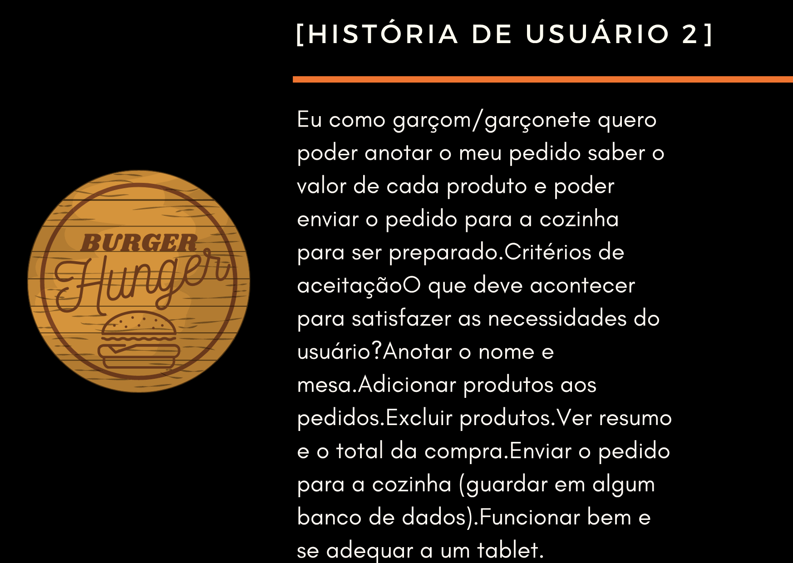
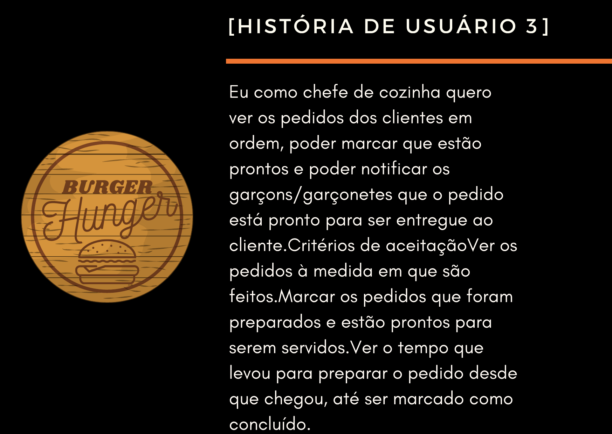
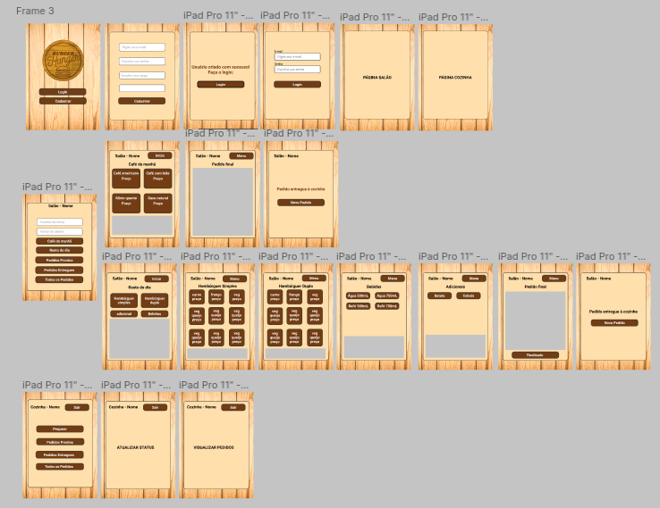
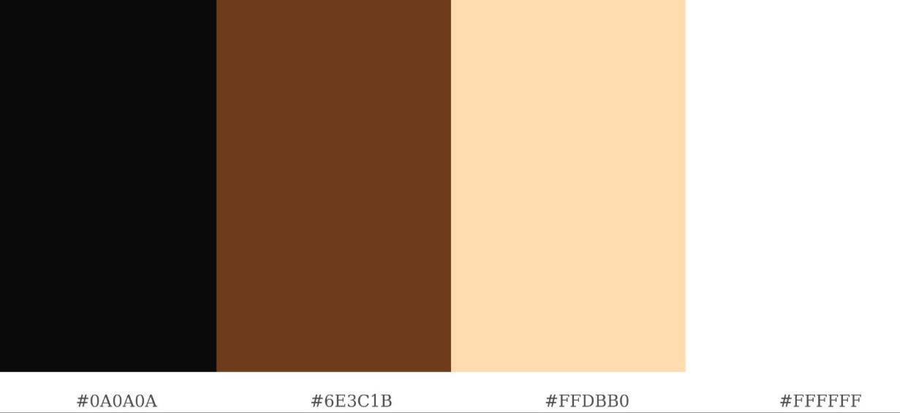
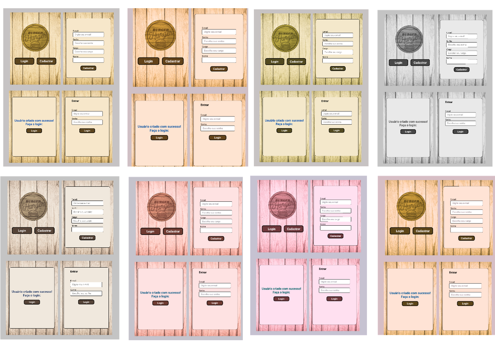
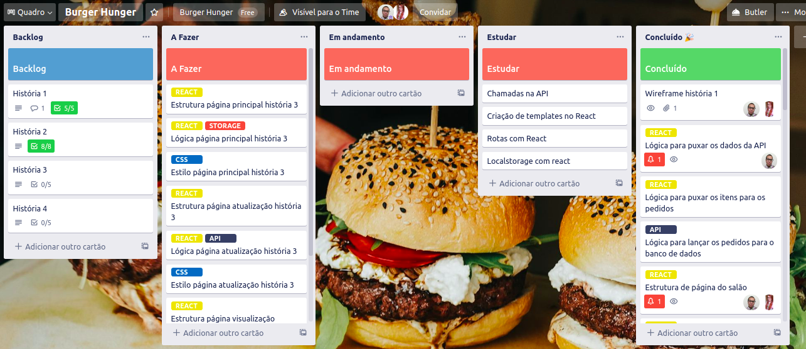

# Burger Hunger :hamburger:

Acesse nossa página web clicando [aqui.](https://burgerhunger.vercel.app/) :computer_mouse: Realizado pelas desenvolvedoras:  [Ana Beatriz](https://github.com/biacostadev) e [Nayara Fugii](https://github.com/NayaraFugii).

O **Burger Hunger**  é uma página que foi criada para um pequeno restaurante de hamburgueres  que faz entregas 24 horas que está crescendo Com isso, para atender a demanda , os funcionários tem a necessidade de realizar os pedidos  dos clientes pelo tablet :iphone: e enviá-los para a cozinha, onde os pedidos são feitos por ordem de horário e após prontos, enviado ao garçom para a entrega.

O cliente precisa que os 2 menus compostos por **café da manhã** e **resto do dia** , do qual ele oferece em seu estabelecimento,  apareçam na tela separadamente e conforme fosse escolhido o item, o valor seria acrescentado na comanda.  

# Historias de Usuários :notebook_with_decorative_cover:

# Protótipos :black_nib:

O protótipo foi elaborado para que o funcionário o utilize pelo **iPad Pro**. Foram realizados testes de usabilidade para usuários com daltonismo, e botões grandes para facilitar a leitura.

Pensamos também na reutilização de telas para que não houvesse dificuldade no carregamento, pois se trata de um serviço dinâmico.

# Metodologia Ágil :label:

Nosso planing foi feito atravéz do **Trello**, onde foi definida as sprints por histórias de usuários e tarefas separadas de acordo com o que cada uma escolheu.

## Tecnologias Utilizadas :computer:

>HTML
>CSS
>JavaScript
>ReactJs
>Consumos de API
>GIT
>GitHub
>Trello

## Implementações futuras :thought_balloon:

- Interface para realização de pedidos dos clientes. 
- Visualização tempo médio de realização de entrega do pedido.
- O menu do café da manhã seria bloqueado após o horário estipulado pelo estabelecimento para que não houvesse enganos ao realizar os pedidos.
